# FPTools
##### Email and VoIP management tools built with Flutter

---
###### Problem
Having multiple FastPanel instances to manage multiple SMTP domains is slow and time-consuming. Having multiple Voiso and CommPeak clusters adds to complexity and slows down the workflow.
###### Solution
Application that leverages FastPanel API to manage multiple instances simultaneously to ease creation, removal and management of users. Having option to view Voiso balance and users of multiple clusters helps with that too.
> THIS APP IS UNFINISHED! This app is a tool I've made for my job, it is made in a way that it could be adapted to other systems (like other email servers and VoIPs) but it ultimately is a WiP app that will likely be never finished or maintained. Use at your own risk!
---
#### App features
 - UI, optimised for multiple screen sizes and split-screen work
 - Automatic theme change, based on system color and mode
 - Copying from clipboard for faster user creation:
 
 - Pasting to clipboard for easier user management in spreadsheets
 - SOCKS Proxy support for remote work:
 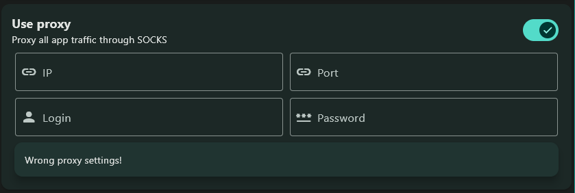
 - Option to limit user amount that is shown to operator to optimize load times:
 
 - Data is stored on LAN server and is synchronized between all app operators:
 
 - Randomized passwords for new accounts
 - Logging actions for debugging
 - Easy Voiso and CommPeak cluster management
 - Easy FastPanel instance editing and connecting
 - Ability to manage multiple users at the same time
 - Ability to manage multiple emails of the single user
 - Easy creation and management of labels for quick email group selection
 - Automatic renewal of login sessions for all connected FastPanels
 - All data is encrypted using AES/CBC encryption

 ---
 #### Interface
 ###### Homepage
 Displays relevant information (like amount of users, servers, labels or VoIP balances) and allows quicker navigation within the app.
 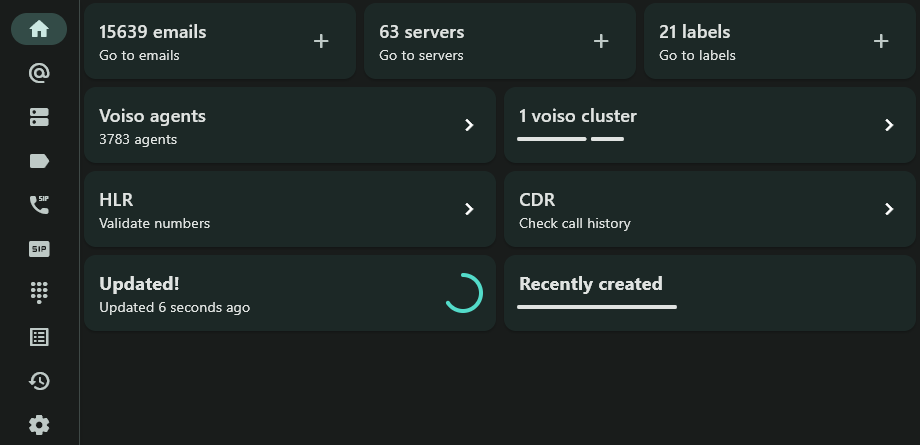
 
###### Emails page
Allows for easy search and editing of the emails and users
 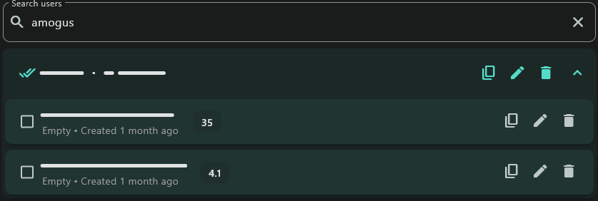
 
This page also allows editing passwords of and removing email accounts.
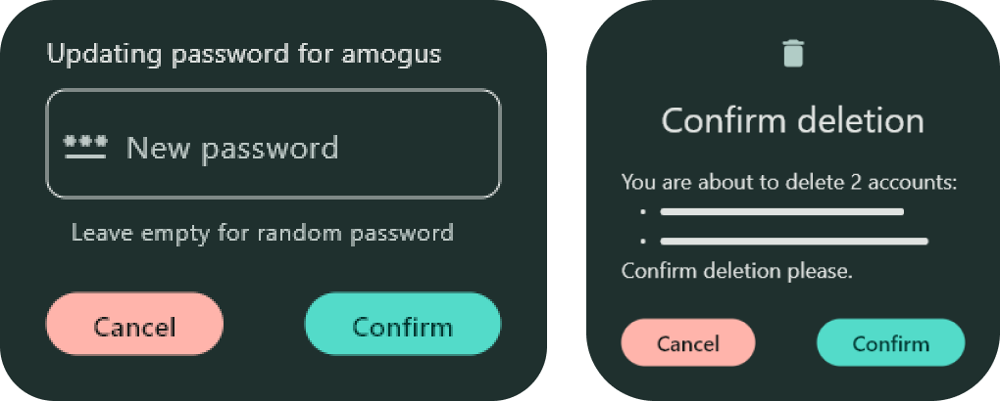

Operator can also create multiple users on multiple domains at the same time using this app.
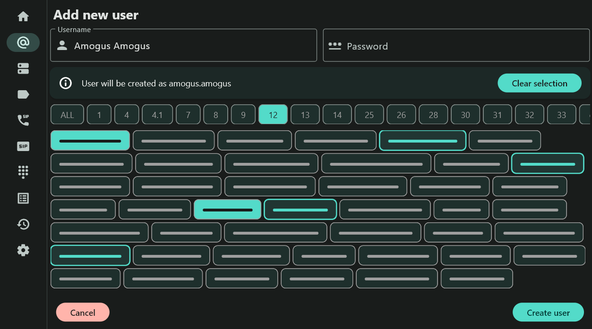

###### Servers page
This page allows for enabling and disabling FastPanel domains (multiple domains may be present on a single server).
 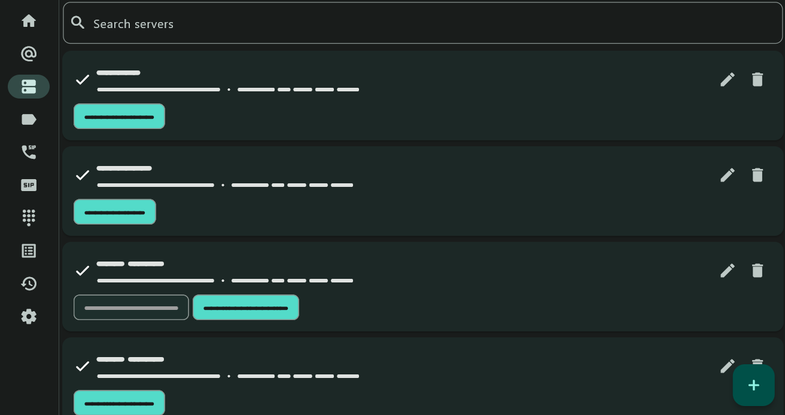
 
You can also easily add and verify login data for FastPanel instance.
 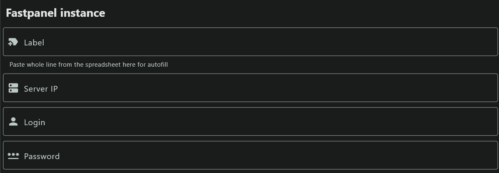
 
###### Labels page 
This page allows for easy configuration of labels - groups of domains that help find domains, owned by those groups within the list of domains.
You can reorder labels in the list so they are displayed in any order operator needs them to be.
 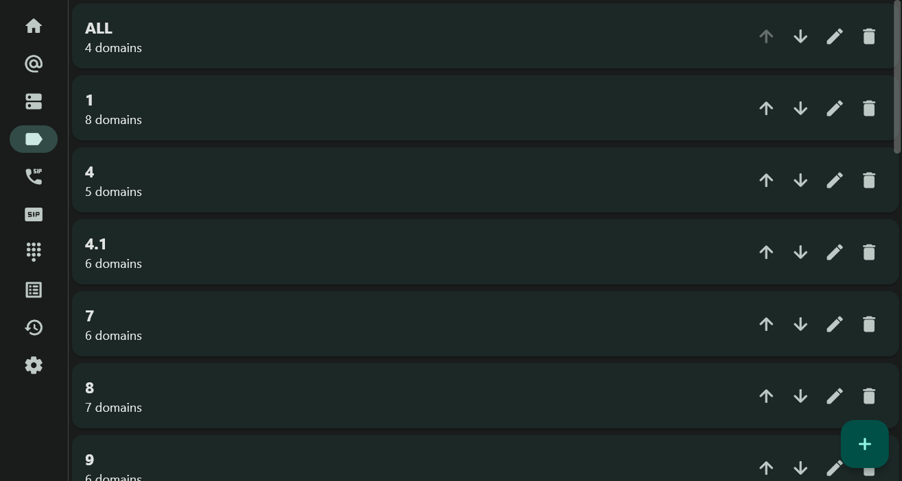

###### Agents page
This page shows list of Voiso agents with short summary about them. Voiso API doesn't allow write access on users, so this section is read-only.
 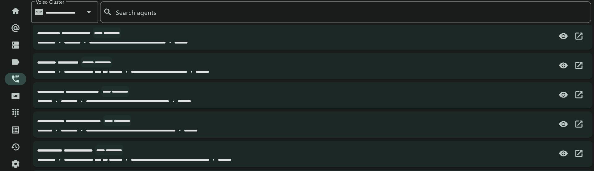
 
As stated earlier, it is not possible to create or edit Voiso agents via API, so this page is a read-only info about the agent with intention to make this page into a agent editor later.
 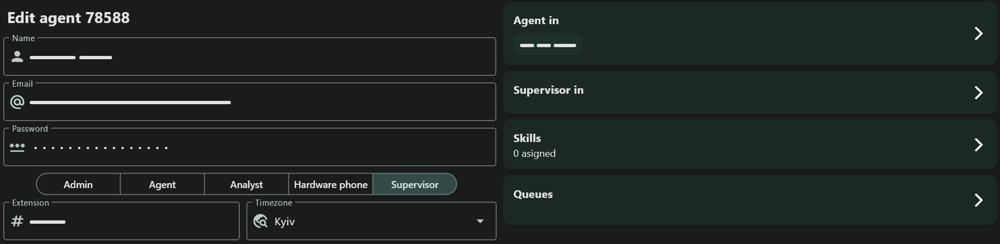

###### Clusters page
This page shows Voiso and CP clusters with their respectful balances.
 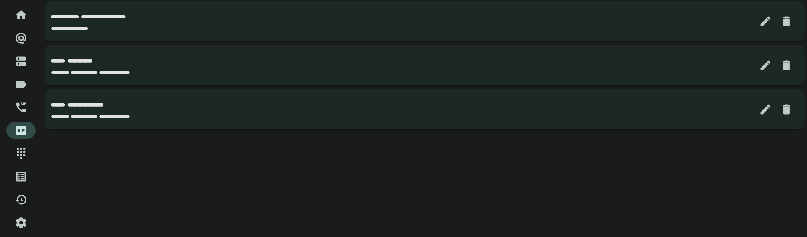
 
You can also add new and edit existing clusters here.
 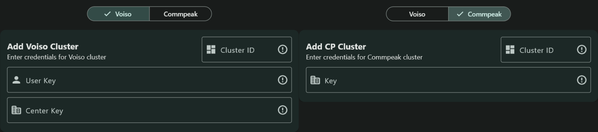

###### HLR page
You can check number availability/validity using CommPeak and [REDACTED] API.
 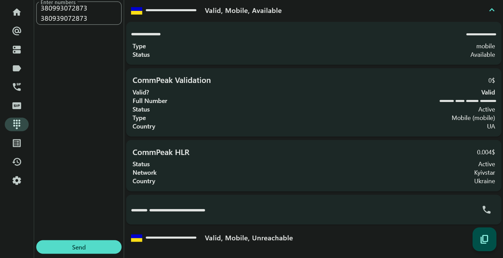
 
###### CDR page
This page shows Call Detail Records, allowing period selection and differentiating between clusters.
 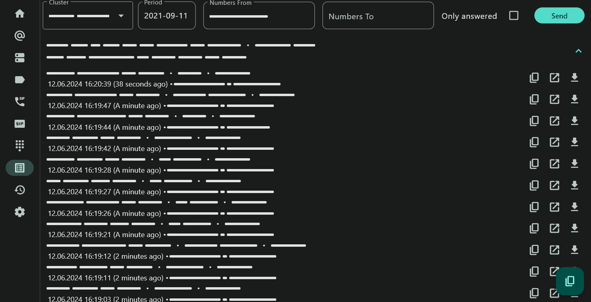
